# codealpha_tasks_1
# 🍔 Food App UI/UX Design

A modern food delivery / ordering mobile application designed in **Figma**.  
This project showcases multiple screens including login, profile, search filters, cart, and more.

---

## 🔗 Figma Link
[👉 View the Design on Figma](https://www.figma.com/design/JFCgjUweIQXCuSoUNgGkRt/Food-app?node-id=0-1&t=UtQvbbmEcrF7i5oZ-1)

---

## 🖼 Screenshots Preview

| Screen | Preview |
|--------|---------|
| **Splash** |  |
| **Login** | 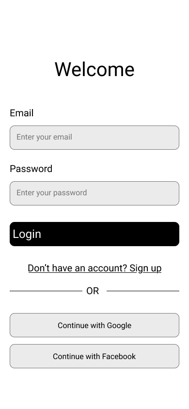 |
| **Home** | 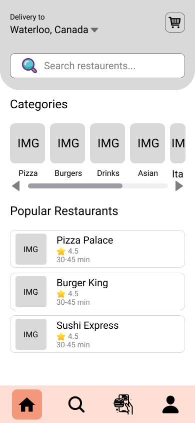 |
| **Profile** | 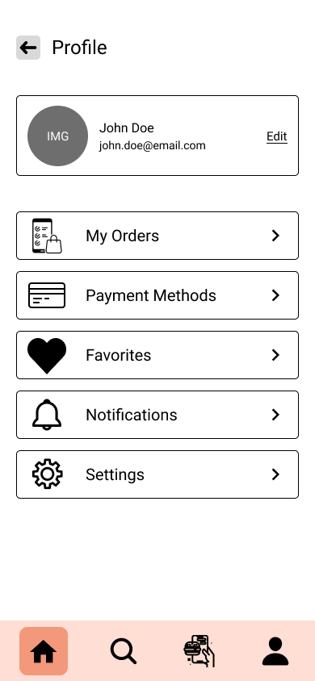 |
| **Order Tracking** | 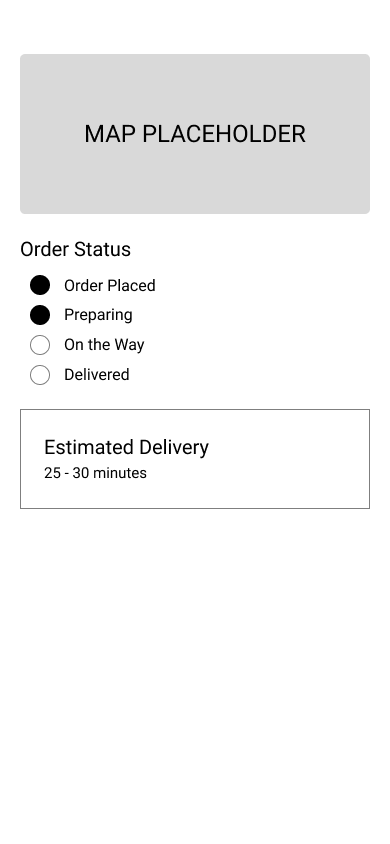 |
| **Checkout Screen** | 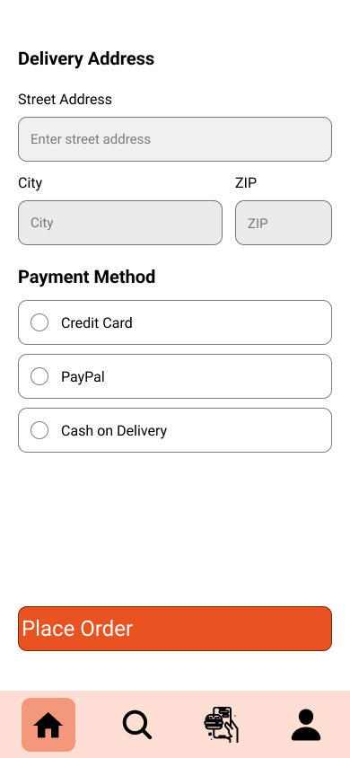 |
| **Cart** | 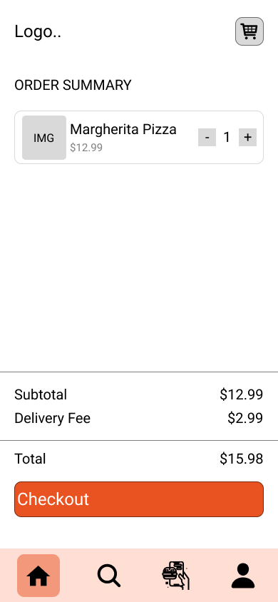 |
| **Restaurant Detail** | 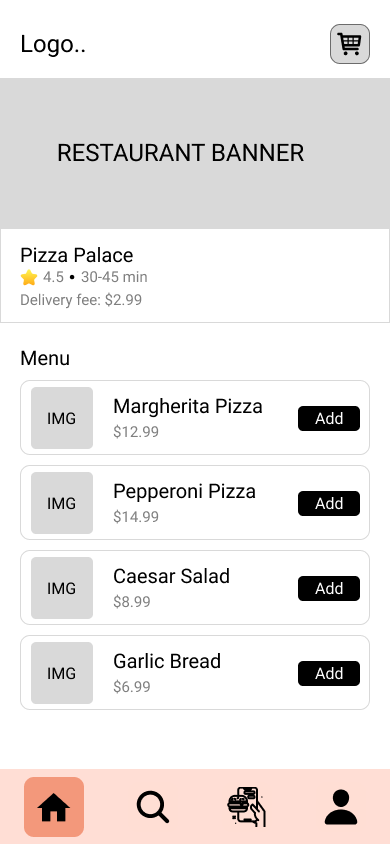 |
| **Tabs** |  |
| **Mexican Search** | 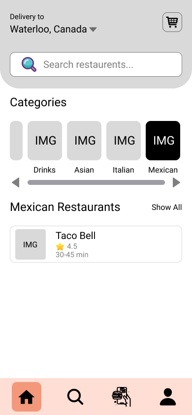 |
| **Italian Search** | 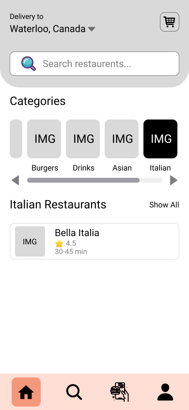 |
| **Asian Search** |  |
| **Drinks Search** | 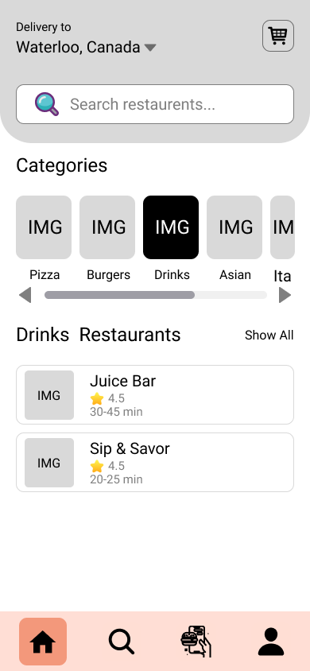 |
| **Burger Search** | 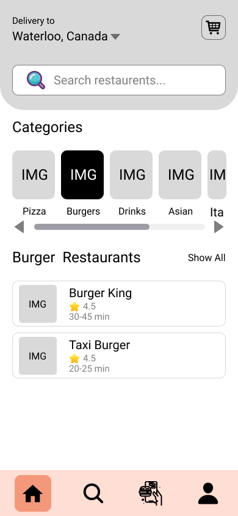 |
| **Pizza Search** | 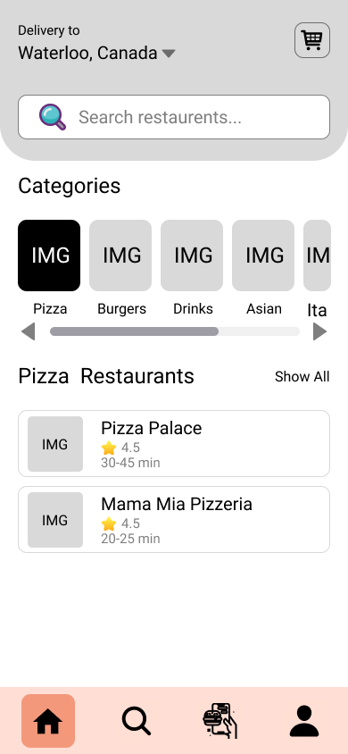 |

---

## 🎨 Features
- Clean and minimal UI  
- Easy navigation and ordering process  
- Multiple cuisine search filters (Mexican, Italian, Asian, Drinks, Burger, Pizza)  
- Order tracking & checkout flow  
- Profile and restaurant details screen  

---

## 🛠 Tools Used
- **Design Tool:** Figma  
- **Version Control:** Git & GitHub  

---

## 👤 Author
Designed by **Jannatul Ferthaous**  
UI/UX Designer  

